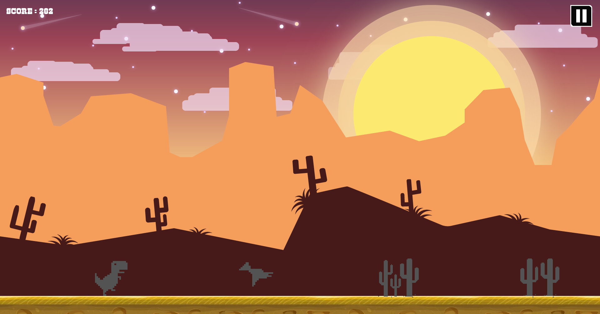
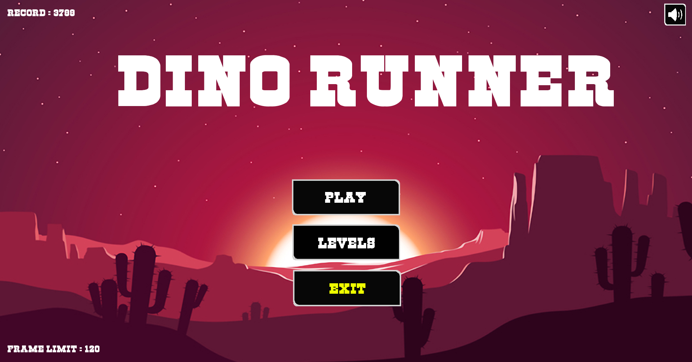
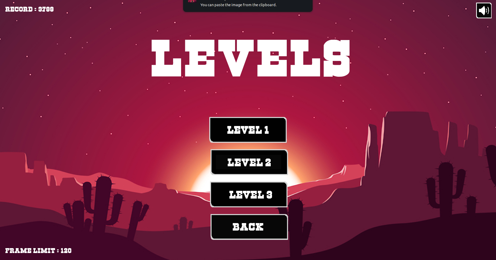
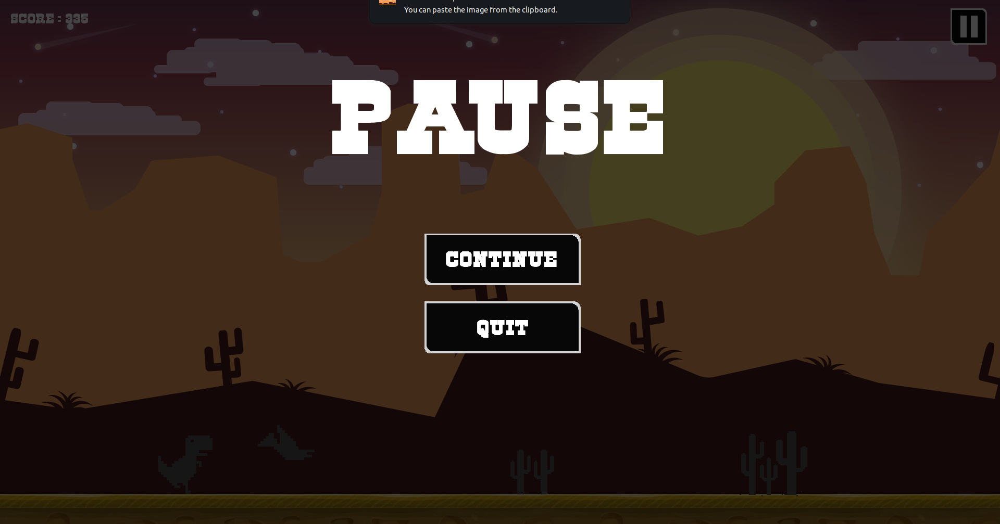

# My Runner - Finite Endless Running Game

## Overview



**My Runner** is a small video game based on the rules of a finite Endless Running Game. The player controls a character who runs through a map, avoiding obstacles and enemies by jumping. The objective is to score as many points as possible before the player either finishes the map or dies.

## Repository Information

- **Binary Name:** `my_runner`
- **Language:** C
- **Compilation:** via Makefile, including `re`, `clean`, and `fclean` rules

## Requirements

### Must-Have Features
- **Window Closing:** The window must be closed using events.
- **Keyboard Input:** The program must manage input from the keyboard.
- **Animated Sprites:** The program must contain animated sprites rendered using sprite sheets.
- **Moving Elements:** The program must contain moving elements (rotating, translating, or scaling).
- **Parallax Scrolling:** The background must include parallax scrolling with at least 3 objects moving at different speeds.
- **Map File:** The program must take a file as an argument which will contain the map of your current game.
- **Score Display:** The program must display a score that updates regularly during the game.
- **Game End:** The program must have an end condition, either a victory or a defeat.
- **Basic Physics:** The program must handle basic game physics (jumping, falling, hitting a wall).
- **Sound Effects:** The program must have at least one music track and one sound effect.

### Should-Have Features
- **Random Enemies:** The program should have randomly spawning enemies.
- **Consistent Animations:** Animations and movements should not depend on the computer's speed and should be timed using `sfClock` elements.
- **Window Size:** The window should be between 800x600 pixels and 1920x1080 pixels.
- **Frame Rate:** The window should have a limited frame rate to prevent lag.
- **Help Option:** The program should accept the `-h` option to display usage information.
- **User Interactions:** Possible user interactions should be explicitly explained in the usage.

### Could-Have Features
- **Multiple Levels:** The program could have several different levels.
- **Main Menu:** The program could have a main menu.
- **Pause Menu:** The program could have a pause menu.
- **High Scores:** The program could store the highest score achieved.
- **Infinite Mode:** The program could have an infinite mode where the map is generated randomly until the player dies.
- **Character Customization:** The program could allow the user to customize their character.
- **Bonus/Malus:** The program could include bonuses and maluses that affect the player's score or abilities.

The `.legend` file at the root of your repository should describe the map formatting.

## Usage

```
./my_runner map.txt
```

### Options

- `-h` : Display the usage and quit.
- `-i` : Launch the game in infinite mode.

### User Interactions

- `SPACE_KEY` : Jump

## Authorized Functions

### From the C Library
- `malloc`
- `free`
- `memset`
- `rand`
- `srand`
- `time` (only with `srand`)
- `(f)open`
- `(f)read`
- `(f)write`
- `(f)close`
- `getline`

### From the CSFML Library
- All functions

### From the Math Library
- All functions

## Makefile

The Makefile should include the following rules:
- `re` : Recompile the project.
- `clean` : Remove temporary files.
- `fclean` : Remove all compiled files.

## Achievements

You have completed the project, and all functionalities have been implemented according to the specifications. Congratulations on your hard work and for reaching this milestone!

## Map Description

The game works with a map of 3 vertical rows:

```
00000000000000000000000000000000
00000000000000000000000000000000
xxxxxxxxxxxxxxxxxxxxxxxxxxxxxxxx
```

- On the first row, you can place only the number `1`.
- On the second row, you can place the numbers `1`, `2`, and `3`.
- The third row represents the floor of the game.

Legend:
- `1` = Crow
- `2` = Cactuce
- `3` = End of Game Portal

## Images






